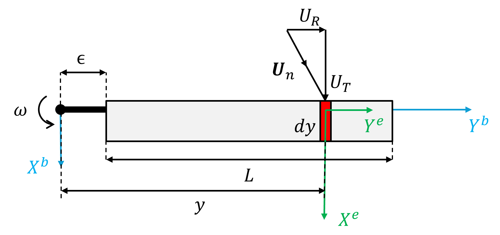
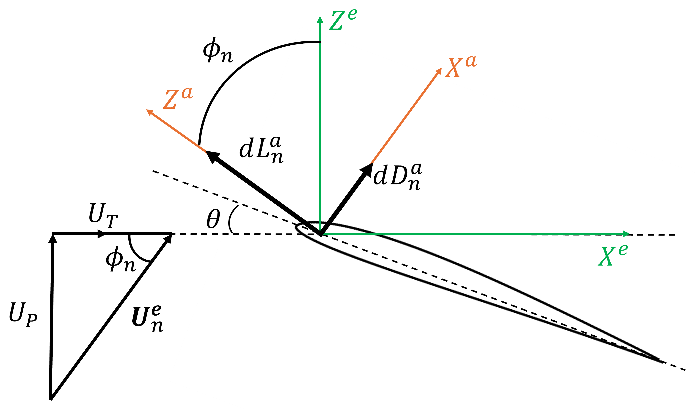

# Blade Element Theory

The BET is a simplified model to study the rotor performance [@leishman_principles_2006]. With BET, it is possible to make predictions about radial and azimuthal aerodynamic load distributions over the rotor disk. Its principal is based on a quasi-2D airfoil blade section, which generates the aerodynamic forces and moments that shall be integrated over the blade length. With \gls{bet} methodology, it is possible to perform a rotor's first designing shape stage in terms of blade geometry.

{#fig-blade width="80%"}

Figure \ref{fig:blade_bet} presents the basic idea for the \gls{bet} in which it is possible a blade element $n$ (in red) with a width $\mathrm{d}y$ at a distance $y$ from the rotation shaft, Also the $n$-element velocity vector $\mathbf{U}_n$ in the element reference frame is shown. Note that in this figure, the $z$-axis is not presented; however, applying the right-hand rule, it is possible to determine that its direction is toward the reader. The $n$-element is considered as a 2D airfoil under a flow with a velocity $\mathbf{U}_n \in \mathbb{R}^3$, in element's reference frame, $O^e$,

$$
    \mathbf{U}_n^e = 
    \begin{bmatrix}
        U_t \\
        U_r \\
        U_p \\
    \end{bmatrix},
    \label{eq:velocity_vector_in_element}
$$

where $U_t$ is the tangential component of the velocity, $U_r$ is the radial component of the velocity, and $U_p$ is the vertical component of the velocity. The radial velocity component, $U_r$, is usually not considered for lift by the independence principle, but it is considered when computing the drag in forward flight [@leishman_principles_2006]. When considering a 2D airfoil discretisation of the blade, the radial velocity $U_r$ is not taken into consideration for the 2D analysis. So, the resultant velocity at the blade element $n$ is computed as

$$
    U_n = \sqrt{U_t^2 + U_p^2} \equiv || \mathbf{U}_n^e ||.
    \label{eq:result_vel_norm}
$$

For each blade element, the general flow and forces applied and the pressure centre of the airfoil are presented in figure \ref{fig:element_bet}. All over the blade and azimuthal positions, this is not a standard configuration for the reference frames, forces and velocities. This influences the way that angles are determined in each element. This is taken into consideration, and the following equations are for all the cases different.

{#fig-element width="80%"}

The aerodynamic loads, in the aerodynamic reference frame, $O^a$, are also represented in figure by \ref{fig:element_bet}, where its horizonal component (in $X^a$ axis) or drag force, $\mathrm{d}D_n^a$, is computed as

$$
    \mathrm{d}D^a_n = \frac{1}{2} \rho c_a U_n^2 C_d,
    \label{eq:drag_element}
$$

while vertical compenent (in $Z^a$ axis) or lift force is computed as

$$
    \mathrm{d}L^a_n = \frac{1}{2} \rho c_a U_n^2 C_l,
    \label{eq:lift_element}
$$

where $\rho$ is the air density, in $\unit{kg / m^3}$, $c_a$ is the airfoil chord in $\unit{m}$ and $C_l$ and $C_l$ are the lift and drag coefficients, respectively, as functions of the angle of attack, $\alpha$, and number of Reynolds, $Re$,

$$
    Re = \frac{\rho U_n c}{\mu},
    \label{eq:reynolds_number}
$$

where $\mu$ is the dynamic viscosity of the air in \unit{N s/m^2}, meaning that

$$
    C_l \equiv C_l(\alpha, Re) \quad \text{and} \quad C_d\equiv C_d(\alpha, Re).
$$

In section \ref{section:aero_model}, a detailed explanation of how the lift, $C_l$, and drag, $C_d$, coefficients are obtained is presented. Keeping the focus on the aerodynamic load, it is possible to construct the elementary aerodynamic force, $d\mathbf{F}^a_n \in \mathbb{R}^3$, in the aerodynamic reference frame, $O^a$, as

$$
    d\mathbf{F}^a_n = \begin{bmatrix}
        \mathrm{d}D^a_n \\ 0 \\ \mathrm{d}L^a_n
    \end{bmatrix},
    \label{eq:vector_aero_force}
$$

In other words, the vector presented in Eq. \ref{eq:vector_aero_force} is the force vector of each element that shall be written in Earth-fixed coordinates for the force equation, Eq. \ref{eq:force_equation}. For a simple implementation, the choice stands for computing the aerodynamic reference frame's\ forces, denoted with up script $^a$, and applying a cycle to compute the rotor's total force, $\mathbf{F}^r_{rotor}$, as function of all the elementary forces, $\mathrm{d}\mathbf{F}^a_n$, along the blade length and azimutal positions. Then, it is necessary to introduce the rotation matrices between the various reference frames. First from the aerodynamic to the element frame, then to the blade frame and rotor frame, and finally to the Earth-fixed frame. From the blade and to the element reference frame, there is only a translation due to the element's position, being $O^e$ with the same orientation that $O^b$, which means that the rotation matrix is the identity matrix, $\boldsymbol{\mathcal{I}}$. So equation \ref{eq:aero_to_blade_force} presents the direct transformation of the elementary aerodynamic force, $d\mathbf{F}^a$, from the aerodynamic reference frame to the blade reference frame:

$$
    d\mathbf{F}^b = \boldsymbol{R}^{ot}(\hat{y}, \phi_n) d\mathbf{F}^a
    \label{eq:aero_to_blade_force}
$$

where $\boldsymbol{R}^{ot}(\hat{y}, \phi_n)$ stands for the rotation matrix along $y$-axis and the inflow angle for each of the blade's elements, $\phi_n$. The rotation process is described in section \ref{sec:rotation_matrices}. Finally, in the rotor reference frame, the elementary force, $d\mathbf{F}^r$, is given by the rotation given by the blades ' azimuthal angle, $\psi_n$, as

$$
    d\mathbf{F}^r_n = \boldsymbol{R}^{ot}(\hat{z}, \psi_n) d\mathbf{F}^b
$$

or as a sequence of both rotations, $\phi_n$ and $\psi_m$,

$$
    d\mathbf{F}^r_{m,n}= \boldsymbol{R}^{ot}(\hat{z}, \psi_m) \boldsymbol{R}^{ot}(\hat{y}, \phi_n) d\mathbf{F}^a.
    \label{eq:element_force_rotor_frame}
$$

In terms of applied torque from the aerodynamic forces to the rotor's centre, the elementary torque applied for each element, $d\mathbf{Q}^r_n$, is given by 

$$
    d\mathbf{Q}^r_{m,n} = \mathbf{r}^r_n \times \left[ \boldsymbol{R}^{ot}(\hat{z}, \psi_m) \boldsymbol{R}^{ot}(\hat{y}, \phi_n) d\mathbf{F}^a \right], 
    \label{eq:element_torque_rotor_frame}
$$

where $\mathbf{r}^r_n$ stands for the position vector from the rotor's centre to the blade $n$-element. As a simplification of the next formulas, Eq.  \ref{eq:simplication_rotation_bet} is introduced.

$$
    \boldsymbol{R}^{ot}(\hat{z}, \psi_m) \boldsymbol{R}^{ot}(\hat{y}, \phi_n) \equiv \underset{a \to r}{\boldsymbol{R}^{ot}}
    \label{eq:simplication_rotation_bet}
$$

and then, force expression, \ref{eq:element_force_rotor_frame}, can be rewritten as

$$
    d\mathbf{F}^r_{m,n} = \underset{a \to r}{\boldsymbol{R}^{ot}} d\mathbf{F}^a.
    \label{eq:element_force_rotor_frame_simplified}
$$

and for the torque, \ref{eq:element_torque_rotor_frame}, the same expression can be used

$$
    d\mathbf{Q}^r_{m,n} = \mathbf{r}^r_n \times \left[ \underset{a \to r}{\boldsymbol{R}^{ot}}  d\mathbf{F}^a \right] .
    \label{eq:element_torque_rotor_frame_simplified}
$$.

Knowing all the elementary forces and torques, the total force and torque applied to the rotor can be computed by integrating over the blade length between the blade's root, at a distance $\epsilon$, and the blade's tip, at a distance of $S_b + \epsilon$. For the $b$-blade's force is given by

$$
    \mathbf{F}^r_{m,n} = \int_\epsilon^{S_b + \epsilon} d\mathbf{F}^r_{m,n} \mathrm{d}y = \int_\epsilon^{S_b + \epsilon} \underset{a \to r}{\boldsymbol{R}^{ot}}  d\mathbf{F}^a \mathrm{d}y ; 
$$

while the blade's torque is computed as

$$
    \mathbf{Q}^r_{m,n} = \int_\epsilon^{S_b + \epsilon} d\mathbf{Q}^r_{m,n}  \mathrm{d}y = \int_\epsilon^{S_b + \epsilon} \mathbf{r} \times \left[ \underset{a \to r}{\boldsymbol{R}^{ot}}  d\mathbf{F}^a \right] \mathrm{d}y
$$

As a final step, the forces shall be integrated as a function of the rotor's azimuthal discretisation, $\psi_m$. To achieve this, the integration is assumed as an average of all of the forces and torques produced for the blade in each of the azimuthal sections.

$$
    \mathbf{F}_{rotor}^r = \frac{N_b }{N_{\psi}} \sum_{m=1}^{N_{\psi}} \mathbf{F}^r_{m} = \frac{N_b }{N_{\psi}} \sum_{m=1}^{N_{\psi}} \int_\epsilon^{S_b + \epsilon} \underset{a \to r}{\boldsymbol{R}^{ot}}  d\mathbf{F}^a \mathrm{d}y
    \label{eq:total_rotor_force_rotor_frame}
$$

$$
    \mathbf{Q}_{rotor}^r = \frac{N_b }{N_{\psi}} \sum_{m=1}^{N_{\psi}} \mathbf{Q}^r_{m} = \frac{N_b }{N_{\psi}} \sum_{m=1}^{N_{\psi}} \int_\epsilon^{S_b + \epsilon} \mathbf{r} \times \left[ \underset{a \to r}{\boldsymbol{R}^{ot}}  d\mathbf{F}^a \right] \mathrm{d}y
    \label{eq:total_rotor_torque_rotor_frame}
$$

Also, in equations \ref{eq:total_rotor_force_rotor_frame} and \ref{eq:total_rotor_torque_rotor_frame}, it is introduced the term of the number of blades, $N_b$, as the rotor is composed of multiple blades. $\mathbf{F}_{rotor}^r$ and $\mathbf{Q}_{rotor}^r$ expressions models the rotor's aerodynamic behaviour.
