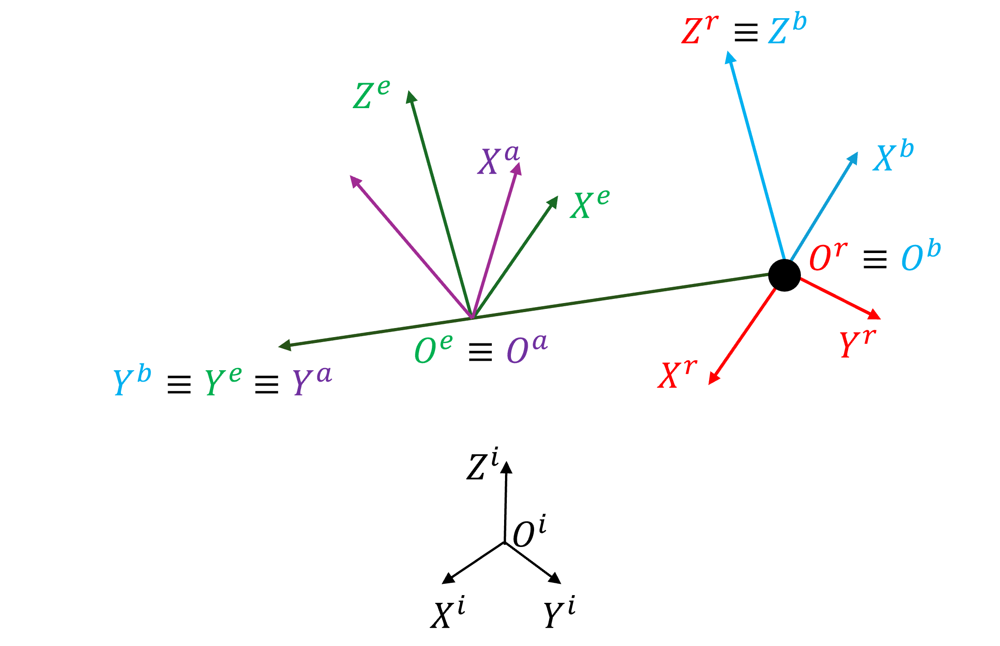
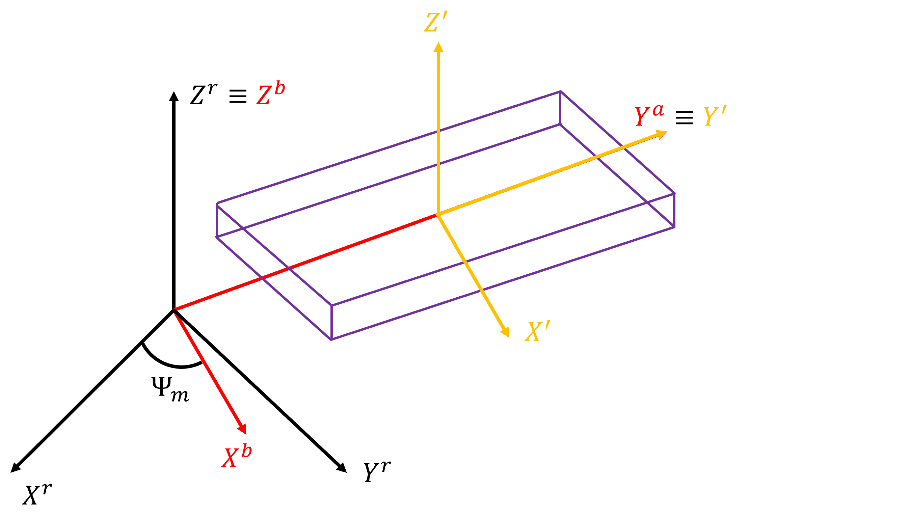

# Introduction

In the previous section, the importance of the topic of this thesis was discussed. In this chapter, the background of the topic is further presented, where the problem is physically and mathematically defined, and the theory is explored. The main goal of this chapter is to provide a solid foundation for the reader to understand the problem and the proposed approach.

A key starting point is to define the body, in this case, the spacecraft model to be analysed. The spacecraft is considered a point-mass simulating the desired payload to recover, with a rotor coupling. [Fig.&nbsp;1](#fig-vehicle-model) presents a four-blade rotor coupled to the point mass. The point mass does not play any role other than is influenced by the gravity field, which will pull the vehicle to the ground and has no dimensions, only mass. In [Fig.&nbsp;1](#fig-vehicle-model), the point mass is represented as a black dot for better visual understanding.

On the other hand, the rotor is defined by the blades, which are considered to be rigid, with a blade span, [$S_b$](nomenclature.md#var_Sb), equal for all blades. The rotor has a certain number of blades, [$N_b$](nomenclature.md#var_Nb), 4 in the case of [Fig.&nbsp;1](#fig-vehicle-model). Also, the blades are equally distributed, with the angle between the blades, [$\delta\psi$](nomenclature.md#var_dpsi), equal for symmetry reasons.

{#fig-vehicle-model width="60%"}

## Reference Frames

For the development of the mathematical model that follows and considering what was present, it is important to introduce the reference frames which will define the vehicle’s dynamics. In [Fig.&nbsp;2](#fig-reference_frames), the two principal references are presented: Earth frame, [$O^i$](nomenclature.md#var_Oi), (black axes in [Fig.&nbsp;2](#fig-reference_frames)) and the rotor’s frame [$O^r$](nomenclature.md#var_Or) (red axes in [Fig.&nbsp;2](#fig-reference_frames)). The Earth frame, [$O^i$](nomenclature.md#var_Oi), is an inertial frame positioned at any point on the Earth's surface. It is also called _Navigation Frame_ [@soler2014Fundamentals] once it rotates with Earth, and it is very handy when planes travel from one point to another [@soler2014Fundamentals]. On the other hand, the rotor frame, [$O^r$](nomenclature.md#var_Or), or body frame [@soler2014Fundamentals] is a system centred at any point of the symmetry plane of the aircraft. In this case, the [$O^r$](nomenclature.md#var_Or) is the position at the CG of the vehicle, which is coincident with the point-mass position. The [$O^r$](nomenclature.md#var_Or) has its $z$-axis aligned, from the CG, vertically with the rotor's shaft pointing positively upwards the rotor.

{#fig-reference_frames width="80%"}

Also, there are three other important reference frames in order to apply BET in Fig.\ref{fig:reference_frames}: the blade reference frame (red axes in [Fig.&nbsp;2](#fig-reference_frames)), the element reference frame (green axis in [Fig.&nbsp;2](#fig-reference_frames)) and the 2D aerodynamic reference frame (purple axes in [Fig.&nbsp;2](#fig-reference_frames)). These axes are explained further in page [Blade Element Theory](bet.md) where BET is presented.

!!! note
    From here on, when a variable or vector is written in any reference frame, it will be denoted by its correspondent superscript, e.g., if a variable or vector, [$x$](nomenclature.md#var_x), is written in the rotor frame, it will be denoted by [$x^r$](nomenclature.md#var_xr).

## Vehicle Dynamics

The spacecraft is nevertheless able to translate and rotate in space, meaning that a 6DOF dynamic model is considered. The dynamic model is based on Newton's second law of motion [@soler2014Fundamentals;@vepa_flight_2023], which states that the acceleration of an object is directly proportional to the net force acting upon the object and inversely proportional to the object. For the translation motion Eq. $\left(\ref{eq:force_equation}\right)$ is used [@soler2014Fundamentals;@vepa_flight_2023].

$$
\mathbf{F}^i = \frac{\mathrm{d}}{\mathrm{d}t} \left( M \mathbf{V} \right)^i
\label{eq:force_equation}
$$

where [$\mathbf{F}$](nomenclature.md#var_F) in $\mathbb{R}^3$ is the external force, [$M$](nomenclature.md#var_M) is the mass of the vehicle in kg, and [$\mathbf{V}$](nomenclature.md#var_V) in $\mathbb{R}^3$ is the vehicle’s linear velocity in $\unit{m/s}$. 

In terms of the applied forces, since it is considered the recovery of a spacecraft, the Earth's gravity force is applied at the point-mass model, meaning no rotation will occur due to gravity. Another important force is the rotor force. So, the total force [$\mathbf{F}^i$](nomenclature.md#var_Fi) in $\mathbb{R}^3$ is computed as:

$$
\mathbf{F}^i = \mathbf{F}_{gravity}^i + \mathbf{F}_{rotor}^i
$$

where [$\mathbf{F}_{gravity}^i$](nomenclature.md#var_Fgravity) and [$\mathbf{F}_{rotor}^i$](nomenclature.md#var_Frotor) are in $\mathbb{R}^3$ and expressed in N.

Regarding angular motion, the sum of external moments [$\mathbf{M}$](nomenclature.md#var_M) at the CG is equal to the rate of change in angular momentum [@soler2014Fundamentals;@vepa_flight_2023]:

$$
\mathbf{M}^i = \frac{\mathrm{d}}{\mathrm{d}t} \left( [\mathbf{I}] \boldsymbol{\omega} \right)^i \quad \Leftrightarrow \quad
\mathbf{M}^r = \frac{\mathrm{d}}{\mathrm{d}t} \left( [\mathbf{I}] \boldsymbol{\omega} \right)^r + \boldsymbol{\omega} \times \left( [\mathbf{I}] \boldsymbol{\omega} \right)^r
\label{eq:vehicle_rotarion}
$$

where [$\mathbf{I}$](nomenclature.md#var_I), in $\unit{kg/m^2}$, is the mass inertia tensor. 

From the vehicle dynamics perspective, the CD model of the rotor does not change its position inside the rotors' reference frame and any moment generated by the rotor also implies the rotation of the rotor reference frame in Earth's reference frame, [$O^i$](nomenclature.md#var_Oi). When rotated, the angles between [$O^i$](nomenclature.md#var_Oi) and the rotor’s reference frame [$O^r$](nomenclature.md#var_Or) are called Euler angles and are denoted [$\boldsymbol{\Omega}_E$](nomenclature.md#var_OmegaE)$ in $\mathbb{R}^3$.

Hence, there is a degree of freedom given by the rotor's shaft, which means that the rotation of the rotor over the z-axis of [$O^r$](nomenclature.md#var_Or) can be decoupled to another equation, and the moment applied does not rotate the rotor's reference frame about its own axis.

### Gravity Force

The gravitational force acting on the rotor, represented by [$\mathbf{F}_{gravity}^i$](nomenclature.md#var_Fgravity) in $\mathbb{R}^3$, can be expressed in the inertial reference frame as:

$$
\mathbf{F}_{gravity}^i = 
\begin{bmatrix}
0 & 0 & -G \frac{m \cdot M_E}{r^2}
\end{bmatrix}^T
$$

where [$G$](nomenclature.md#var_G) is the gravitational constant in m³/(kg·s²), [$M_E$](nomenclature.md#var_ME) is the Earth's mass in kg, [$m$](nomenclature.md#var_m) is the vehicle mass, and [$r$](nomenclature.md#var_r) represents the distance between the vehicle's centre of gravity and the Earth's centre of mass in m. This force acts along the radial direction, pointing toward the Earth's centre.

### Inertia Tensor

The angular momentum is to angular velocity what linear momentum is to linear velocity. Just as mass quantifies the resistance of an object to changes in its position, the mass inertia tensor [$\mathbf{I}$](nomenclature.md#var_I) measures an object's resistance to changes in its rotational motion. Mathematically, the inertia tensor [$\mathbf{I}$](nomenclature.md#var_I) is a symmetric 3 by 3 matrix:

$$
[\mathbf{I}] = \begin{bmatrix} I_{xx} & I_{xy} & I_{xz} \\ I_{xy} & I_{yy} & I_{yz} \\ I_{xz} & I_{yz} & I_{zz} \end{bmatrix}
$$

where the matrix elements are the moments and products of inertia about a reference frame [$O_{xyz}$](nomenclature.md#var_Oxyz), computed as:

$$
I_{xx} = \int (y^2 + z^2) \, \mathrm{d}m, \quad 
I_{yy} = \int (x^2 + z^2) \, \mathrm{d}m, \quad 
I_{zz} = \int (x^2 + y^2) \, \mathrm{d}m
$$

$$
I_{xy} = - \int xy \, \mathrm{d}m, \quad 
I_{xz} = - \int xz \, \mathrm{d}m, \quad 
I_{yz} = - \int yz \, \mathrm{d}m
$$

In this study, the system is considered as a point mass and a rotor, which means that only the rotor's mass is accounted for in the inertia tensor. The rotor is composed of [$N_b$](nomenclature.md#var_Nb) blades, each with mass [$m_b$](nomenclature.md#var_mb), which are considered as thin plates for inertia tensor calculation. In its principal axes centred in the blade's centre of mass, a thin plate has its longer side along the $y$-axis (blade span [$S_b$](nomenclature.md#var_Sb)), shorter side along $x$-axis (airfoil chord [$c_a$](nomenclature.md#var_ca)) and thickness along $z$-axis (airfoil thickness [$t_a$](nomenclature.md#var_ta)). The inertia tensor [$\mathbf{I}$]′ of a flat plate in its principal axes is:

{#fig-inertia-scheme width="80%"}

$$
[\mathbf{I}]' = \begin{bmatrix}
\frac{1}{12} m_b (S_b^2 + t_a^2) & 0 & 0 \\
0 & \frac{1}{12} m_b (c_a^2 + t_a^2) & 0 \\
0 & 0 & \frac{1}{12} m_b (S_b^2 + c_a^2)
\end{bmatrix}
$$

For a rotor with multiple blades and a root distance [$\epsilon$](nomenclature.md#var_epsilon) from the blade to the rotor centre, a transformation process is applied. Defining [$\psi$](nomenclature.md#var_psi) as the azimuthal position, the blades are separated by an angle:

$$
\delta \psi = \frac{2 \pi}{N_b}
$$

Setting one of the blade's reference frames aligned with the rotor's reference frame, the rotation angle of blade $m=1$ over $z$-axis equals [$\Psi_1 = 0$](nomenclature.md#var_Psi1). Introducing the rotation matrix [$\boldsymbol{R}^{ot}$](nomenclature.md#var_Rot) and using the parallel axis theorem, the total inertia tensor of the rotor in the rotor frame is:

$$
[\mathbf{I}]^r = \sum_{m=1}^{N_b} \boldsymbol{R}_n^{ot}[(m-1)\delta\psi] \left\{ [\mathbf{I}]' + m_b \epsilon^2 \boldsymbol{\mathcal{I}} \right\} \boldsymbol{R}_n^{ot}[(m-1)\delta\psi]^T
$$

where [$\boldsymbol{\mathcal{I}}$](nomenclature.md#var_Identity) is the 3x3 identity matrix.

## Rotor's Dynamics

For the rotor's dynamics, further considerations are needed to account for the forces acting on the payload's point mass and the moments providing rotational freedom to the rotor. The rotor rotates along its shaft, which directly influences the aerodynamic loads.

The rotor’s rotational dynamics over its shaft can be expressed as:

$$
\frac{d \Omega}{dt} = \tau_z
\label{eq:rotor_rotation}
$$

where [$\Omega$](nomenclature.md#var_Omega) is the angular velocity in rad/s, and [$\tau_z$](nomenclature.md#var_tauz) is the angular acceleration along the $z$-axis of the rotor's reference frame [$O^r$](nomenclature.md#var_Or), computed as:

$$
\tau_z = \frac{T}{I_{zz}}
$$

where [$T$](nomenclature.md#var_T) is the rotor's propulsive torque in N·m, and [$I_{zz}$](nomenclature.md#var_Izz) is the moment of inertia about the rotor’s principal rotation axis in kg·m².

High rotational velocities can cause numerical stability issues when integrating the equations of motion [@arnold_numerical_2011;@press_numerical_2007]. The time-step in the ODE solver must be chosen carefully to maintain accuracy while controlling computational cost. Instead of finer discretisation, both blade and azimuthal load distributions are considered per time step, avoiding numerical instability and decoupling Eqs. $\left(\ref{eq:vehicle_rotarion}\right)$ and $\left(\ref{eq:rotor_rotation}\right)$.
